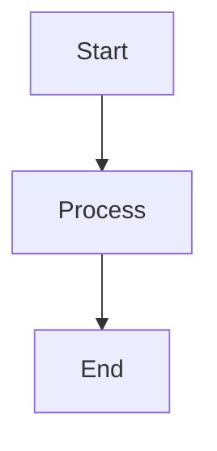

# Doqs


Static documentation site built with [Astro](https://astro.build/) and [Starlight](https://starlight.astro.build/) for the NBA ELT Project.

## Live Site

**[https://doqs.jyablonski.dev](https://doqs.jyablonski.dev)**

## Quick Start

```bash
# Install dependencies
make setup

# Start development server
make up

# Run tests
make test
```

The site will be available at `http://localhost:4321`.

## Commands

| Command                 | Description                                |
| ----------------------- | ------------------------------------------ |
| `npm run dev`           | Start local dev server at `localhost:4321` |
| `npm run build`         | Build production site to `./dist/`         |
| `npm run preview`       | Preview production build locally           |
| `npm run test`          | Build the site, then run tests with Vitest |
| `npm run test:watch`    | Run tests in watch mode                    |
| `npm run test:ui`       | Run tests with Vitest UI                   |
| `npm run test:coverage` | Build the site, then run tests with coverage |

## Project Structure

```
doqs/
├── public/                 # Static assets (favicon, etc.)
├── src/
│   ├── assets/             # Images and media files
│   ├── components/         # Custom Astro components (Footer, etc.)
│   ├── content/
│   │   └── docs/           # Documentation content (Markdown/MDX)
│   │       ├── architecture/   # System architecture docs
│   │       ├── data/           # Data source documentation
│   │       ├── guides/         # How-to guides
│   │       ├── runbooks/       # Operational runbooks
│   │       └── services/       # Service documentation
│   ├── content.config.ts   # Content collection schema
│   └── plugins/
│       └── mermaid.mjs     # Mermaid diagram support
├── tests/                  # Vitest test files
├── dist/                   # Production build output
├── astro.config.mjs        # Astro configuration
├── vitest.config.js        # Vitest configuration
└── package.json
```

## How It Works

### Starlight Theme

This site uses [Starlight](https://starlight.astro.build/), Astro's official documentation theme. Starlight provides:

- **Automatic sidebar generation** - Sidebar sections are auto-generated from directory structure in `src/content/docs/`
- **Built-in search** - Powered by [Pagefind](https://pagefind.app/)
- **Dark/light mode** - Theme toggle included by default
- **Responsive design** - Mobile-friendly out of the box

### Content

Documentation pages are written in Markdown (`.md`) or MDX (`.mdx`) and placed in `src/content/docs/`. The content schema in `content.config.ts` extends the default Starlight schema with optional `tags` and `author` frontmatter fields.

### Mermaid Diagrams

The custom remark plugin in `src/plugins/mermaid.mjs` enables [Mermaid](https://mermaid.js.org/) diagram support. Use fenced code blocks with the `mermaid` language identifier:

````markdown

````

### Plugins

- **[starlight-links-validator](https://github.com/HiDeoo/starlight-links-validator)** - Validates internal links during build
- **[starlight-image-zoom](https://github.com/HiDeoo/starlight-image-zoom)** - Click-to-zoom functionality for images

### Testing

Tests are written with [Vitest](https://vitest.dev/) and cover content validation, link checking, build output, and configuration. The test scripts build the site first so Starlight can validate internal links and the build-output tests can inspect fresh files. Run `npm run test:coverage` to generate a coverage report.
