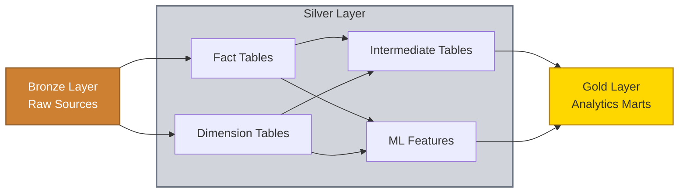

This project is an end-to-end data platform delivering insights and predictions for the NBA season via a custom-built interactive dashboard. The system is fully containerized and deployed on AWS using best practices, including CI/CD pipelines, Terraform-managed infrastructure, and automated testing.

---

### User-Facing Services

- [Frontend Dashboard](https://nbadashboard.jyablonski.dev)
- [REST API](https://api.jyablonski.dev)
- [Internal Documentation Site](https://doqs.jyablonski.dev)

### Core Components

- [Ingestion Script](https://github.com/jyablonski/nba_elt_ingestion) – Scrapes, loads, and stores raw NBA data.
- [dbt Project](https://github.com/jyablonski/nba_elt_dbt) – Cleans, transforms, and models data.
- [ML Pipeline](https://github.com/jyablonski/nba_elt_mlflow) – Generates daily win probability predictions.
- [Terraform](https://github.com/jyablonski/aws_terraform) – Manages infrastructure as code.

Operational costs are minimal (around $1/month), primarily by leveraging the AWS Free Tier and other third-party cloud services.

---

## Architecture Diagram


---

## System Components

### 1. Data Ingestion

- Python Script using Pandas, SQLAlchemy, and various other packages to gather data from a series of sources
- Data is ingested into the Bronze Layer of a cloud-hosted Postgres Database, and also backed up to S3 for redundancy
- Utilizes a feature flag table to determine what data to pull on each run
- Ran via ECS Fargate as part of the daily pipeline orchestrated with AWS Step Functions

> _Note: The NBA blocks AWS IPs from accessing their API, necessitating custom scraping solutions._

---

### 2. dbt Transformations

- Transforms raw Bronze data through a medallion architecture (Bronze -> Silver -> Gold)
- **Silver Layer**: Fact and dimension tables standardize column names, enforce data types, and perform light cleaning; intermediate tables build custom models for downstream services and enable early data quality validation
- **Gold Layer**: Analytics-ready marts optimized for consumption by the REST API and Frontend Dashboard
- Utilizes [dbt-expectations](https://github.com/metaplane/dbt-expectations) for comprehensive data quality testing
- Intermediate tables in the Silver layer isolate and validate transformed models early, preventing data quality issues from propagating to the Gold layer and downstream services
- Ran via ECS Fargate as part of the daily pipeline orchestrated with AWS Step Functions



---

### 3. ML Pipeline

- Python Script which pulls purpose-built ML feature datasets from the Silver Layer and generates win probability predictions for upcoming games using a Logistic Regression model
- Model features include recent team performance, rest days, and active injuries for both teams
- Predictions are written back to the Gold Layer in Postgres and served by the REST API & Frontend Dashboard
- Ran via ECS Fargate as part of the daily pipeline orchestrated with AWS Step Functions

---

### 4. REST API

- Python Application which pulls transformed & enriched data from the Gold Layer in Postgres and serves it over public HTTP endpoints
- Includes a lightweight web app for users sign in and make betting predictions for upcoming games
- Also includes Admin pages for managing various aspects of the project, like feature flags
- Deployed as a serverless application (AWS Lambda) for $0 / month.
- Utilizes CloudFront & Route 53 for distribution and routing to https://api.jyablonski.dev.


#### Query Example

```sh
curl -H "Accept: application/json" https://api.jyablonski.dev/v1/league/game_types

```

---

### 5. Frontend Dashboard (Dash)

- Python Application built with Dash which pulls data from Postgres to serve various tables, metrics, and graphs
- Fully interactive with filtering and drill-down capabilities.
- Hosted on free-tier resources and routed via Route 53 to https://nbadashboard.jyablonski.dev.


---

## Infrastructure

### Terraform

- Entire AWS stack provisioned via Terraform using custom-built modules for:

  - S3 Buckets
  - IAM Roles
  - ECS Tasks & Services
  - Lambda Functions
  - PostgreSQL Infrastructure

[Modules Repo](https://github.com/jyablonski/aws_terraform/tree/master/modules)

---

### Common Modules

Custom internal Python package [`jyablonski_common_modules`](https://github.com/jyablonski/jyablonski_common_modules) used by various services for:

- AWS utilities (S3, Secrets Manager helpers)
- Standardized logging
- Postgres connection management & upsert functions

Ensures DRY principles and code consistency across services.

---

### Orchestration (Step Functions)

- AWS Step Functions orchestrates the daily pipeline (Ingestion -> dbt -> ML) for $ 0 / month
- It triggers each Task to run in ECS Fargate in a free-tier VM
- Apache Airflow would be preferred, but opted for Step Functions due to cost efficiency

---

### Database Management

- Postgres serves as the core database
- All schemas, users, roles, and permissions managed via [Terraform](https://github.com/jyablonski/aws_terraform/blob/master/postgresql.tf)
- Least privilege principles are implemented with strict role-based access control

```hcl
module "reporting_schema" {
  source = "./modules/postgresql/schema"

  schema_name   = "reporting"
  database_name = var.jacobs_rds_db
  schema_owner  = var.postgres_username

  read_access_roles  = [module.rest_api_role_prod.role_name, module.dash_role_prod.role_name]
  write_access_roles = [module.dbt_role_prod.role_name]
  admin_access_roles = [var.postgres_username]
}
```

Although it's an OLTP Database and not a true data warehouse, it effectively handles the analytical workloads for the project while being the most cost-effective solution available.
