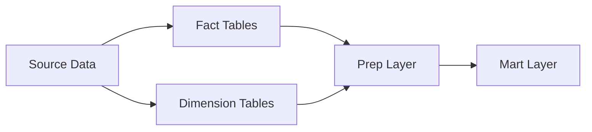

This project is an end-to-end data platform delivering insights and predictions for the NBA season via a custom-built interactive dashboard. The system is fully containerized and deployed on AWS using best practices, including CI/CD pipelines, Terraform-managed infrastructure, and automated testing.

Production Services:

- [Frontend](https://nbadashboard.jyablonski.dev)
- [REST API](https://api.jyablonski.dev)
- [Internal Documentation Site](https://doqs.jyablonski.dev)

Core components include:

- **Ingestion Script** – Scrapes, loads, and stores raw NBA data.
- **dbt Project** – Cleans, transforms, and models data.
- **ML Pipeline** – Generates daily win probability predictions.
- **REST API** – Serves data to internal and external users.
- **Frontend Dashboard** – Visualizes trends and metrics.
- **Infrastructure as Code** – Provisioned and managed via Terraform.

Operational costs are kept minimal (~$12/month), leveraging the AWS Free Tier and optimizing architecture for efficiency and scalability.

---

## Architecture Diagram


---

## System Components

### 1. Data Ingestion

- Python-based scraper using **Pandas** and **SQLAlchemy** to gather data from various webpages
- Data is ingested into **Postgres (RDS)** and backed up to **S3**.
- Fault-tolerant with Slack-integrated error logging.
- Feature-flagged via a control table for season/offseason toggles.
- Deployed as a Docker container and ran via **ECS Fargate**, orchestrated with **AWS Step Functions**.

> *Note: The NBA blocks AWS IPs from accessing their API, necessitating custom scraping solutions.*

---

### 2. dbt Transformations

- Models source data into **Fact** and **Dimension** tables, followed by **Prep** and **Mart** layers.
- Implements **dbt-expectations** for data quality, including metric bounds and row count checks
- Mart layer feeds both the REST API and frontend dashboard
- Deployed via **ECS Fargate** as part of the daily pipeline.



---

### 3. ML Pipeline

- Predicts daily win probabilities using a **Logistic Regression** model built with **scikit-learn**.
- Factors in team performance, rest days, and injury reports.
- Outputs are stored in Postgres for API & dashboard consumption.
- Deployed post-dbt transformation via **ECS Fargate**.

---

### 4. REST API

- Exposes endpoints for public consumption and internal admin tasks.
- Includes a lightweight web app for managing feature flags and other admin controls.
- Deployed via **AWS Lambda Function URL** with **CloudFront** & **Route 53** for distribution and routing.
  


---

### 5. Frontend Dashboard (Dash)

- Built with **Dash (Plotly)** to visualize trends and metrics.
- Fully interactive with filtering and drill-down capabilities.
- Hosted as a long-running **ECS Fargate** service behind an **ALB** and routed via **Route 53**.


---

## Infrastructure

### Terraform

- Entire AWS stack provisioned via **Terraform** using custom-built modules for:

  - **S3 Buckets**
  - **IAM Roles (e.g., GitHub Actions runners)**
  - **ECS Tasks & Services**
  - **Lambda Functions**
  - **PostgreSQL & Snowflake Infrastructure**

[Modules Repo](https://github.com/jyablonski/aws_terraform/tree/master/modules)

---

### Common Modules

Custom internal Python package: [`jyablonski_common_modules`](https://github.com/jyablonski/jyablonski_common_modules)

- **AWS utilities** (S3, Secrets Manager helpers)
- **Standardized logging**
- **Postgres connection management & upserts**

Ensures DRY principles and code consistency across all services.

---

### Orchestration (Step Functions)

- **AWS Step Functions** orchestrate the daily pipeline (Ingestion → dbt → ML).
- Originally used **EventBridge** but upgraded for more robust orchestration.
- Considered **Apache Airflow**, but opted for Step Functions due to cost-efficiency.

---

### Database Management

- **AWS RDS PostgreSQL** serves as the core operational DB.
- All schemas, users, roles, and permissions managed via Terraform.
- Implements **least privilege** principles with strict role-based access control.
  
```hcl
module "reporting_schema" {
  source = "./modules/postgresql/schema"
  schema_name   = "reporting"
  read_access_roles  = [module.rest_api_role_prod.role_name, module.dash_role_prod.role_name]
  write_access_roles = [module.dbt_role_prod.role_name]
}
```

While not a true analytical DB, Postgres balances performance and cost for the project's current needs.

---

## Closing Notes

This project has evolved from a personal learning experiment into a scalable, full-stack data platform. While focused on NBA data, its architecture and components are transferable to other domains or datasets.