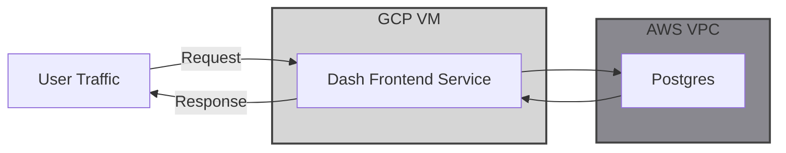

The Dash frontend service retrieves transformed data from the Postgres database to present charts, graphs, and reports, enabling users to generate insights.

---

## Architecture



## How It Works

This frontend service is built with Dash, a Python framework for creating dynamic, interactive web applications. It operates as a server running 24/7, hosting pages and displaying interactive charts, graphs, and tables.

Each page has its own dedicated file to manage its content and functionality.

User interactivity is enabled through Callbacks, which track user-selected options and uses them to update graphs or plots accordingly. For example:

```py
@callback(
    Output("schedule-plot", "figure"),
    Input("schedule-plot-selector", "value"),
)
```

Hover labels need to be manually configured for each plot. Here's an example of how to set them up:

```py
        fig.update_traces(
            hoverlabel=dict(bgcolor="white", font_size=12, font_family="Rockwell"),
            hovertemplate="<b>%{customdata[0]}</b><br>"
            "<b>Wins Differential:</b> %{customdata[1]}<br>"
            "<b>Preseason Over / Under:</b> %{customdata[2]}<br>"
            "<b>Projected Stats:</b> %{customdata[3]}<br>"
            "<b>Status:</b> %{customdata[4]}<br>"
            "<b>Championship Odds:</b> %{customdata[5]}<br>",
        )
        return fig
```

## Libraries

1. dash is the primary package driving the frontend application development
2. Pandas is used to store all data from database to serve throughout various graphs, plots, and tables
3. dash-bootstrap-components is used to provide components to build out the UI

## Production

The Dash Frontend is hosted in GCP on a forever free-tier VM which runs the service 24/7

- This allows for a $0 / month hosting solution for the service

> _Note:_
> This was previously hosted on AWS using an ECS service with an EC2 Auto Scaling Group behind an Application Load Balancer, but [IPv4](https://aws.amazon.com/about-aws/whats-new/2024/02/aws-free-tier-750-hours-free-public-ipv4-addresses/) and AWS [free-tier changes](https://aws.amazon.com/about-aws/whats-new/2025/07/aws-free-tier-credits-month-free-plan/) have increased this cost to around $25 per month which is outside of my comfort range for long-term hosting, so I opted for this alternative hosting option.

Route 53 maps the https://nbadashboard.jyablonski.dev subdomain to the GCP VM's external IP, allowing the dashboard to be accessed via a custom domain across cloud environments.

## CI / CD

### Continuous Integration

Two checks run on every pull request:

- **Code quality** - Ruff and Ty validate formatting, linting, and type correctness.
- **Build & test** - The test suite runs unit tests and integration tests with testcontainers to validate application behavior and Postgres integration.

### Deployment

Once a PR is merged, the deploy pipeline runs:

1. **Re-run CI** to confirm the merged code is valid on the main branch.
2. **Image build** - Builds the service's Docker image with the updated source and dependencies and pushes it to ECR.
3. **VM deploy** - SSHs into the GCP VM, pulls the latest application changes, and restarts the service.

The restarted VM service serves the updated dashboard at https://nbadashboard.jyablonski.dev.
