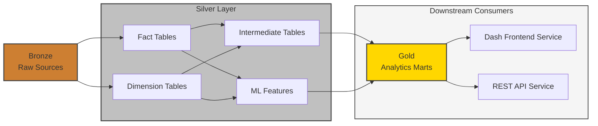
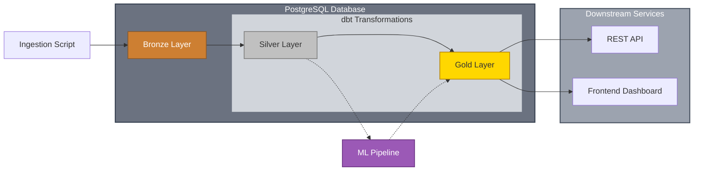

The dbt project transforms and enriches source data in the database, creating new tables for use by downstream services and applications for analytics, reporting, and insights.

---

## Architecture

This project follows a medallion architecture with three layers: Bronze (raw sources), Silver (transformed data), and Gold (analytics-ready marts).

### Data Flow

**Bronze -> Silver -> Gold**

- **Bronze**: Raw source data ingested from upstream systems
- **Silver**: Transformed data layer consisting of:
  - **Fact and Dimension Tables**: Standardize column names, enforce data types, and perform light cleaning on bronze tables
  - **Intermediate Tables**: Build custom models from fact/dimension tables for the dashboard, API, and ML pipeline. They also enable an initial layer of data quality testing before reaching the Gold layer and introducing potential issues to downstream services
  - **ML Features**: Feature engineering and model-ready datasets for the ML pipeline
- **Gold**: Final analytics-ready marts built from intermediate tables and ML pipeline outputs, optimized for consumption by downstream applications

_Note: A `scratch/` folder exists for ad hoc analytics and experimental work._

### ELT Pipeline Orchestration

## How It Works

dbt is a tool that allows you to transform raw data into analytics-ready datasets inside a database using SQL, and incorporates best practices such as version control, modularity, testing, and documentation.

In this project dbt enables dozens of different tables to be built by transforming the raw source data provided by the ingestion script through a structured medallion architecture. This approach provides:

- **Separation of Concerns**: Each layer has a specific purpose, making the pipeline easier to understand and maintain
- **Data Quality Gates**: Testing at the Silver layer prevents bad data from reaching Gold marts and downstream consumers
- **Flexibility**: Intermediate tables and ML features can be built independently while sharing standardized fact and dimension tables
- **Performance**: Gold marts are pre-aggregated and optimized for fast query performance in downstream applications

All of the data processing is done in dbt so that downstream applications just have to do a `select * from table` to grab what they need and display the data to end users. This significantly improves the user experience and makes for a snappy, responsive feel across the REST API and Frontend Dashboard.

## Libraries

1. dbt-core is the primary library supporting the data transformation & enrichment modeling process in SQL
2. dbt-postgres is an adapter package that offers support for dbt to work w/ Postgres
3. sqlfluff is used for SQL Linting + Formatting and is automatically setup in a pre-commit hook

## Production

In production, dbt runs as an ECS Task following the completion of the Ingestion Script. It runs `dbt build --target prod` to refresh all datasets, and also produces the Model that's used by the ML Pipeline to generate win predictions.

- The dbt job typically takes about ~2 minutes to complete

As soon as the dbt job is completed, the ML Pipeline is kicked off to generate win predictions for upcoming games that day.

## CI / CD

For continuous integration (CI), the entire test suite is run on every commit in a pull request using Docker.

- This test suite builds the entire dbt project in a Postgres container running in Docker that has been bootstrapped w/ dummy source data
- Although there's over 400+ dbt resources getting built, this processs takes < 90 seconds to complete because of the low volume of data

After a PR is merged, the continuous deployment (CD) pipeline performs the following steps:

1. Builds the Docker Image for the service which has the updated source code & dependencies
2. Pushes the Docker Image to ECR

On the next subsequent NBA ELT Pipeline run, this new Docker Image will be used when the dbt job is scheduled to be ran in ECS
