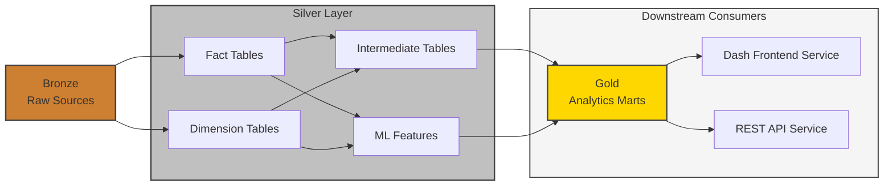
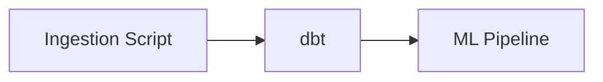

The dbt project transforms and enriches source data in the database, creating new tables for use by downstream services and applications for analytics, reporting, and insights.

---

## Architecture

This project follows a medallion architecture with three layers: Bronze (raw sources), Silver (transformed data), and Gold (analytics-ready marts).

```mermaid
graph LR
    Bronze[Bronze<br/>Raw Sources] --> Fact[Fact Tables]
    Bronze --> Dim[Dimension Tables]

    Fact --> Int[Intermediate Tables]
    Dim --> Int
    Fact --> ML[ML Features]
    Dim --> ML

    Int --> Gold[Gold<br/>Analytics Marts]
    ML --> Gold

    subgraph Silver[Silver Layer]
        Fact
        Dim
        Int
        ML
    end

    subgraph Downstream_Consumers[Downstream Consumers]
        Gold --> DASH[Dash Frontend Service]
        Gold --> API[REST API Service]
    end

    style Bronze fill:#cd7f32,stroke:#444,stroke-width:2px
    style Silver fill:#c0c0c0,stroke:#444,stroke-width:2px
    style Gold fill:#ffd700,stroke:#444,stroke-width:2px
    style Downstream_Consumers fill:#f5f5f5,stroke:#444,stroke-width:1.5px
```

### Data Flow

**Bronze -> Silver -> Gold**

- **Bronze**: Raw source data ingested from upstream systems
- **Silver**: Transformed data layer consisting of:
  - **Fact and Dimension Tables**: Standardize column names, enforce data types, and perform light cleaning on bronze tables
  - **Intermediate Tables**: Build custom models from fact/dimension tables for the dashboard, API, and ML pipeline. They also enable an initial layer of data quality testing before reaching the Gold layer and introducing potential issues to downstream services
  - **ML Features**: Feature engineering and model-ready datasets for the ML pipeline
- **Gold**: Final analytics-ready marts built from intermediate tables and ML pipeline outputs, optimized for consumption by downstream applications

_Note: A `scratch/` folder exists for ad hoc analytics and experimental work._

### ELT Pipeline Orchestration

```mermaid
graph LR
    A[Ingestion Script] --> B[dbt]
    B --> C[ML Pipeline]
```

## How It Works

dbt is a tool that allows you to transform raw data into analytics-ready datasets inside a database using SQL, and incorporates best practices such as version control, modularity, testing, and documentation.

In this project dbt enables dozens of different tables to be built by transforming the raw source data provided by the ingestion script through a structured medallion architecture. This approach provides:

- **Separation of Concerns**: Each layer has a specific purpose, making the pipeline easier to understand and maintain
- **Data Quality Gates**: Testing at the Silver layer prevents bad data from reaching Gold marts and downstream consumers
- **Flexibility**: Intermediate tables and ML features can be built independently using standardized fact and dimension tables
- **Performance**: Gold marts are pre-aggregated and optimized for fast query performance in downstream applications

All of the data processing is done in dbt so that downstream applications just have to do a `select * from table` to grab what they need and serve the data to end users.

## Libraries

1. dbt-core is the primary library supporting the data transformation & enrichment modeling process in SQL
2. dbt-postgres is an adapter package that allows dbt to work with Postgres
3. sqlfluff is used for SQL linting and formatting and is automatically set up in a pre-commit hook

## Production

In production, dbt runs as an ECS task after the Ingestion Script completes. It runs `dbt build --target prod` to refresh all datasets and produce the model used by the ML Pipeline to generate win predictions.

- The dbt job typically takes fewer than 5 minutes to complete
- Because of the volume of data and limited number of models, running the entire project at once fits the use case well and allows for a simple orchestration setup.

As soon as the dbt job is completed, the ML Pipeline is kicked off to generate win predictions for upcoming games that day.

## CI / CD

### Continuous Integration

Two checks run on every pull request:

- **Code quality** — SQLFluff validates SQL formatting and style.
- **Build & test** — A Postgres container is provisioned with bootstrapped data, then the full project is built to confirm every model and test passes. Completes in under 60 seconds.

### Deployment

Once a PR is merged, the deploy pipeline runs:

1. **Re-run CI** to confirm the merged code is valid on the main branch.
2. **Parallel jobs:**
   - **Image build** — Builds the service's Docker image with the updated source and dependencies and pushes it to ECR.
   - **Production build** — Pulls the latest S3 manifest from the previous deploy and uses that state to build any new or changed models in production.
     - *Skip option:* Add the `SKIP_SLIM_CI` label to the PR to skip building changed models in production. The S3 manifest is still updated with the project's new state.
   - **Docs** — Builds dbt Docs and deploys them to S3, served via CloudFront.

The new image is picked up on the next scheduled NBA ELT Pipeline run, when the dbt job executes in ECS.
