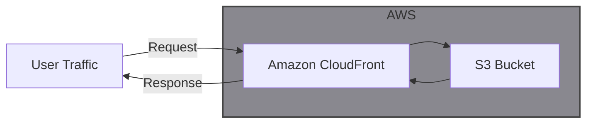

Doqs is an internal site written in Starlight to store documentation on the NBA ELT Project

---

## Architecture

## How It Works

Starlight is a theme and framework built on top of Astro, designed specifically for creating modern, fast, and customizable documentation websites. It leverages Astro’s component-based architecture and static site generation capabilities to deliver highly performant docs. It ships with a default template and a handful of prebuilt components to allow various customization.

During build time, Astro compiles all .md files into static HTML, CSS, and JS.

- It leverages partial hydration, so only interactive components ship JavaScript to the browser, keeping most pages fast and lightweight.
- These static files can then be used to host a static web app on something like Netlify, GitHub Pages, or S3

Starlight enables a very fast initial setup process and offers an elegant solution to hosting an internal documentation site.

To enable the use of [Mermaid Diagrams](https://mermaid.js.org/) throughout the site, a custom remark plugin in the codebase transforms mermaid-labeled code blocks into HTML `
` elements.

- To turn those `
` elements into diagrams, the Mermaid JavaScript library is loaded on every page via a `<script>` tag attached to the `<head>` of every page. This external script detects these elements and renders them as diagrams in the browser.

### .md vs .mdx

Starlight supports both `.md` and `.mdx` files for writing documentation pages. The main difference is that `.mdx` files allow you to embed React components directly within Markdown content, while `.md` files are strictly Markdown.

Some useful components such as `<Tabs>`, `<Steps>`, and `<FileTree>` are available only in `.mdx` files, allowing for more interactive and dynamic documentation experiences.

- For pages where you want to include these interractive components, you can use `.mdx` files.
- For all other pages that only require Markdown content, you should use `.md` files.

## Libraries

1. [Starlight](https://starlight.astro.build/)

## Production

Doqs is deployed to an S3 bucket with static website hosting enabled. A CloudFront distribution pulls from the S3 website endpoint and is routed via Route 53 to a custom domain to enable the content to be served at https://doqs.jyablonski.dev.

## CI / CD

For continuous integration (CI), the entire test suite is run on every commit in a pull request.

- This test suite includes a minimal amount of tests to verify specific features of the application work as expected
- As part of the test suite, the application is also built using `npm build` to ensure any issues are caught before the PR can be merged

After a PR is merged, the continuous deployment (CD) pipeline performs the following steps:

1. The project is built into a set of static HTML, CSS, and JS files in the `dist/` folder
2. The `dist/` folder is then synced to an S3 bucket
3. CloudFront automatically serves the updated content from the S3 bucket
