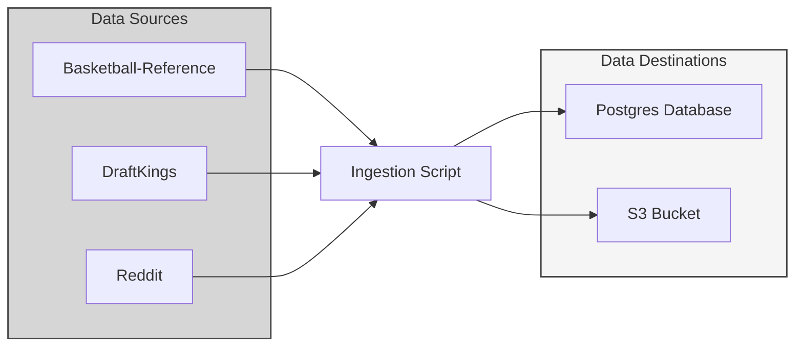
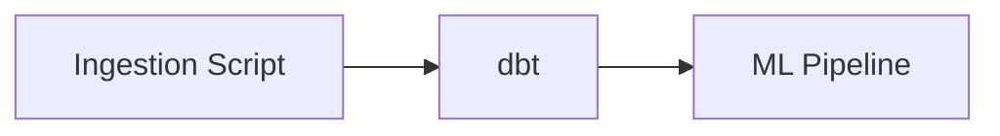

The Ingestion Script handles source data ingestion for the NBA ELT Project.

---

## Architecture

### ELT Pipeline Orchestration

## How It Works

The Ingestion Script performs the following tasks:

1. Retrieves feature flags from the database to determine which endpoints to scrape.
2. Scrapes data from the identified endpoints.
3. Stores source data to Postgres
4. Stores source data to S3 for backup purposes
5. Sends any errors or missing data to Slack

A feature flag table in the database is managed to support all different kinds of functionality within the project. Specifically for the Ingestion Script, some of these flags are used to determine which endpoints should be scraped. For example:

- During the offseason, the `is_season` flag should be disabled as there's no more games being played. This disables all game-related data from being scraped.
- This functionality enables a simple management process for disabling the extraction of this data, or having to do code deploys to comment out various functions during the offseason

## Libraries

1. Pandas is the primary package driving the Ingestion Script development
2. beautifulsoup4 enables web scraping to be performed on various basketball-reference and DraftKings pages
3. praw is used to authenticate to & pull data from the Reddit API
4. nltk provides Sentiment Analysis Functions to be applied on various social media text data
5. jyablonski_common_modules provides various functions to read & write data to Postgres

## Production

The Ingestion Script runs as an ECS task kicked off by an AWS Step Functions pipeline triggered every day at 12 pm UTC.

- The Ingestion Script typically takes about ~2 minutes to complete

As soon as the script finishes and all ingestion data has been loaded, the dbt job begins the transformation process.

## CI / CD

### Continuous Integration

Two checks run on every pull request:

- **Code quality** - The quality workflow validates code standards before the PR can be merged.
- **Build & test** - GitHub Actions installs uv and the project dependencies, provisions a Dockerized Postgres database with bootstrap data, and runs the full test suite with integration coverage.

### Deployment

Once a PR is merged, the deploy pipeline runs:

1. **Re-run CI** to confirm the merged code is valid on the main branch.
2. **Image build** - Builds the service's Docker image with the updated source and dependencies and pushes it to ECR.

On the next NBA ELT Pipeline run, this new Docker image will be used when the Ingestion Script is scheduled in ECS.
